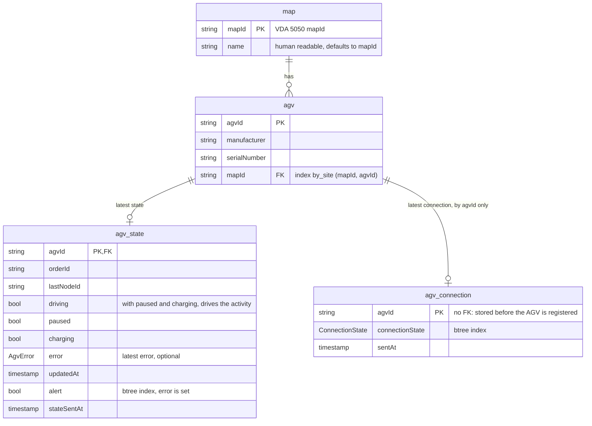

# backend

SpacetimeDB module (TypeScript) for the AGV fleet, VDA 5050 2.1.0 shapes.
Source: `src/schema.ts` (schema), `src/agv.ts` (reducers), `src/fleet.ts` (read side).

| Reducer | Use |
| --- | --- |
| `ingest(messages)` | Batch from `spacetime-ingest`; registers maps and AGVs itself |
| `upsert_map` / `upsert_agv` / `upsert_agv_state` / `upsert_agv_connection` | One write each; tests and seeding |

## Schema

All tables are public. Keys are the VDA 5050 identifiers. `agvId` is `<manufacturer>/<serialNumber>`.

